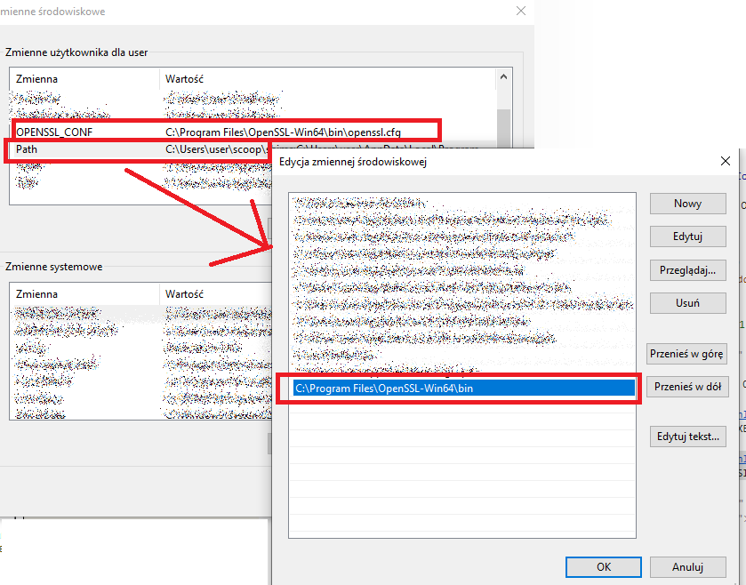
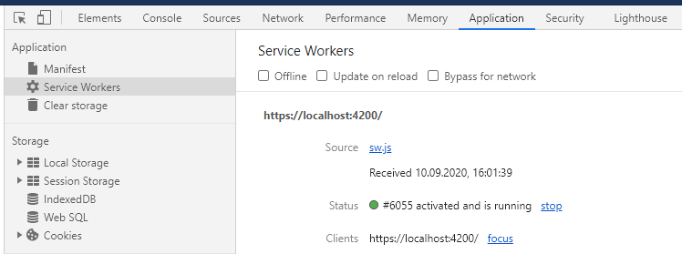
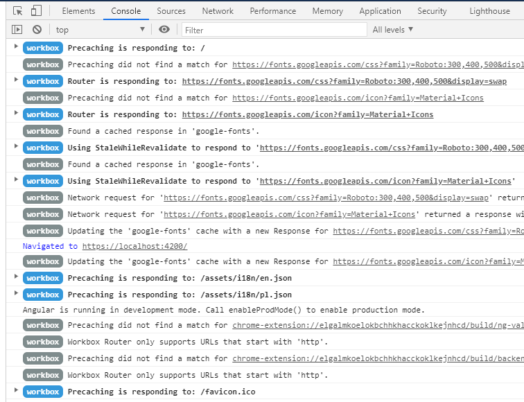
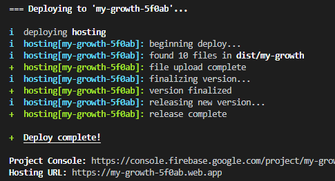
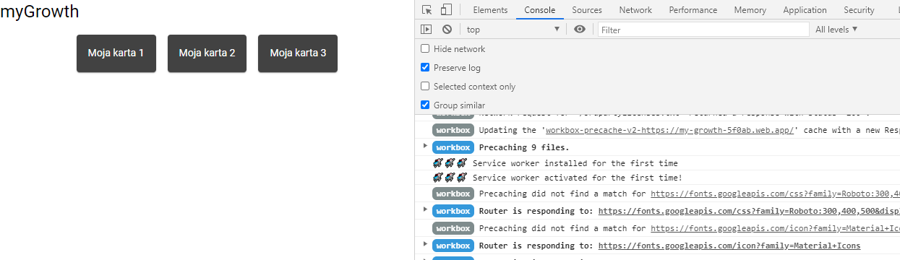

# Documentation
### 👨‍🏫 [Slides from the project launch 🚀](https://docs.google.com/presentation/d/1_duVFxrriQcUvHN8soUtxBVxsjc0qbnwjrXYdlLKupc/edit?usp=sharing)
### 📹 [YT video 🚀](https://youtu.be/kiCBao9eH5g)
### 📰 [Medium article](https://medium.com/@sebastiandenis/learn-web-development-project-has-stared-12821a4971de)
### 🗺️ [Mind map](https://coggle.it/diagram/XvDejQdm23bDR7WZ/t/learn-web-dev-with-gdg)
### 💡 [Markdown cheat sheet](https://guides.github.com/features/mastering-markdown/)

#

## Table of Contents

### 1. [Initial setup](#initial-setup)
### 2. [Adding PWA support with Workbox](#Adding-PWA-support-with-Workbox)
### 3. [HTTPS configuration for localhost](#HTTPS-configuration-for-localhost)
### 4. [Firebase Hosting](#Firebase-hosting)

#

## Initial setup

### Additional resources:
* 👨‍🏫 [Slides](https://docs.google.com/presentation/d/1hxk0Rlc_VHMDvt2Sx70IdtdlJqnJ1fdEPY3DaBycbtI/edit?usp=sharing)
* 📹 [YT video](https://youtu.be/qTRtNNbebx8)

#

### Prerequisites:
* Install NodeJS: [https://nodejs.org/en/](https://nodejs.org/en/)
* Install your favorite IDE: [https://code.visualstudio.com/](https://code.visualstudio.com/)

### Setup:
1. Angular CLI
1. new Angular project
1. Angular Material
1. Angular Flex-layout
1. ngx-translate
1. ng-mocks
1. Cypress

#

### 1.1. Angular CLI [https://cli.angular.io/](https://cli.angular.io/)
```
npm install -g @angular/cli
```

#

### 1.2. New Angular Project [https://angular.io/cli/new](https://angular.io/cli/new)
> Check if everything is ok with --dry-run:

```
ng new my-growth --routing=true --style=scss --prefix=myg --dry-run
```

> Now do it:

```
ng new my-growth --routing=true --style=scss --prefix=myg
```

#

### 1.3. Angular Material [https://material.angular.io/guide/getting-started](https://material.angular.io/guide/getting-started)
```
ng add @angular/material
```

> Choose a prebuilt theme name, or "custom" for a custom theme: **Purple/Green**
> 
> Set up global Angular Material typography styles? **Yes**
> 
> Set up browser animations for Angular Material? **Yes**

#

### 1.4. Angular Flex-Layout [https://github.com/angular/flex-layout](https://github.com/angular/flex-layout)

```
npm i -s @angular/flex-layout
```

> Add FlexLayoutModule into **Imports** of **app.module.ts**

```typescript
@NgModule({
  ...
  imports: [
    ...
    FlexLayoutModule
  ],
  ...
})
export class AppModule {}

```

#

### 1.5. ngx-translate [https://github.com/ngx-translate/core](https://github.com/ngx-translate/core)

```
npm i -s @ngx-translate/core @ngx-translate/http-loader
```

> Add a function and import into **app.module.ts**

```typescript
export function createTranslateLoader(http: HttpClient): TranslateHttpLoader {
  return new TranslateHttpLoader(http, './assets/i18n/', '.json');
}

@NgModule({
  declarations: [AppComponent],
  imports: [
    
    TranslateModule.forRoot({
      loader: {
        provide: TranslateLoader,
        useFactory: createTranslateLoader,
        deps: [HttpClient],
      },
    }),
    MatCardModule
  ],
  providers: [],
  bootstrap: [AppComponent],
})
export class AppModule {}
```

> Create a folder **i18n** inside **my-growth/src/assets/** and inside create 2 files with translations:
>* pl.json
>* en.json

> And put this code inside of the two:
```json
{
    "appTitle": "myGrowth"
}
```

#

### 1.6. ng-mocks [https://github.com/ike18t/ng-mocks](https://github.com/ike18t/ng-mocks)

```
npm i --save-dev ng-mocks
```

#

### 1.7. Cypress [https://docs.cypress.io/guides/getting-started/installing-cypress.html](https://docs.cypress.io/guides/getting-started/installing-cypress.html)

```
npm install cypress --save-dev
```

```
npx cypress open
```

> Inside package.json add new script:

```json
{
  ...  
  "scripts": {
    ...  
    "cypress:open": "cypress open",
    "cypress:run": "cypress run"
  }
}

```

#### 1.7.1. Cypress with TypeScript [https://docs.cypress.io/guides/tooling/typescript-support.html](https://docs.cypress.io/guides/tooling/typescript-support.html)

> Add/modify **mygrowth/cypress/tsconfig.json**:

```json
  {
    "compilerOptions": {
      "strict": true,
      "baseUrl": "../node_modules",
      "target": "es5",
      "lib": ["es5", "dom"],
      "types": ["cypress"]
    },
    "include": [
      "**/*.ts"
    ]
  }
```

#### 1.7.2. First Cypress test

> Create a test file: **my-growth/cypress/integration/app/test.spec.ts**

```typescript
describe('My First Test', () => {
  it('Does not do much!', () => {
    expect(true).to.equal(true);
  });
});
```

> Then run Cypress:

```
npm run cypress:open
```

#

#

#

## Adding PWA support with Workbox

### Additional resources

Great source 🙏♥: (https://golb.hplar.ch/2018/06/workbox-serviceworker-in-angular-project.html)

### 2.1. Install necessary dependencies

> Run:

```
npm install --save workbox-core workbox-cacheable-response workbox-expiration workbox-precaching workbox-routing workbox-strategies workbox-window
```

> Then install some needed dev dependencies:

```
npm install --save-dev webpack webpack-cli workbox-build workbox-cli rimraf ts-loader
``` 
### 2.2. Create a Service Worker file

> Create a Service Worker file:  **my-growth/src/sw.ts**

> And copy this code there:

```typescript
/// <reference lib="webworker" />
import { precacheAndRoute, createHandlerBoundToURL } from 'workbox-precaching';
import { clientsClaim, skipWaiting } from 'workbox-core';
import { registerRoute, NavigationRoute } from 'workbox-routing';
import { NetworkFirst, StaleWhileRevalidate } from 'workbox-strategies';

declare const self: ServiceWorkerGlobalScope;

const enum CacheNames {
  JS = 'js-cache',
  CSS = 'css-cache',
  GOOGLE_FONTS = 'google-fonts',
}

skipWaiting();
clientsClaim();

precacheAndRoute(self.__WB_MANIFEST);

const defaultRouteHandler = createHandlerBoundToURL('/index.html');

const defaultNavigationRoute = new NavigationRoute(defaultRouteHandler, {
  // here we can put the list of files that we want to be handled by the default router (allowlist) or not (denylist)
  // allowlist: [],
  // denylist: []
});

registerRoute(defaultNavigationRoute);

registerRoute(
  /\.js$/,
  new NetworkFirst({
    cacheName: CacheNames.JS,
  })
);

registerRoute(
  // Cache CSS files.
  /\.css$/,
  // Use cache but update in the background.
  new StaleWhileRevalidate({
    // Use a custom cache name.
    cacheName: CacheNames.CSS,
  })
);

// Cache the Google Fonts stylesheets with a stale-while-revalidate strategy.
registerRoute(
  /.*(?:googleapis|gstatic)\.com/,
  new StaleWhileRevalidate({
    cacheName: CacheNames.GOOGLE_FONTS,
  })
);

```

### 2.3. Create Workbox configuration file

> Now we need to create a Workbox configuration file:  **my-growth/workbox-config.js**

```javascript
// great source 🙏♥: https://golb.hplar.ch/2018/06/workbox-serviceworker-in-angular-project.html
module.exports = {
  globDirectory: "dist/my-growth/",
  globPatterns: [
    "**/*.{css,eot,html,ico,jpg,js,json,png,svg,ttf,txt,gif,webmanifest,woff,woff2,webm,xml}",
  ],
  globFollow: true,
  globStrict: true,
  globIgnores: ["**/*-es5.*.js"],
  /*
  We can safely assume that a browser that supports service workers also supports ES2015.
  Therefore we ignore the *-es5.*.js files.
  */
  dontCacheBustURLsMatching: new RegExp(".+.[a-f0-9]{20}..+"),
  /*
  Workbox adds by default a cache-buster to URLs when it loads resources,
  but the Angular CLI already creates files with a hash in their name when we do a production build.
  Therefore, we tell Workbox CLI with the option dontCacheBustURLsMatching
  to not add a cache-buster to URLs of resources that already have a hash in their name.
  The regular expression looks for a 20 character hex string in the filename.
   */
  maximumFileSizeToCacheInBytes: 5000000, // don't cache big files
  swSrc: "dist/my-growth/sw.js",
  swDest: "dist/my-growth/sw.js",
};
```
### 2.4. Webpack configuration

> We also need a Webpack config file:  **my-growth/sw-prod-webpack.config.js**

```javascript
const path = require('path');

module.exports = {
  mode: 'production',
  entry: path.join(__dirname, 'src', 'sw.ts'),
  output: {
    path: path.join(__dirname, 'dist', 'my-growth'),
    filename: 'sw.js'
  },
  module: {
    rules: [
      {
        test: /\.ts$/,
        loader: 'ts-loader',
        exclude: /node_modules/,
        options: {
          onlyCompileBundledFiles: true
        }
      }
    ]
  },
  resolve: {
    extensions: ['.ts', '.wasm', '.mjs', '.js', '.json']
  }
};
```
>

> The last thing we need is to have a scripts that will compile our Service Worker code (for production and for development)

> Add this scripts to the **my-growth/package.json** file:

```json
  "scripts": {
   ...
    "sw-prod-webpack": "rimraf ./dist/my-growth/sw.js && webpack --config ./sw-prod-webpack.config.js --progress --colors && workbox injectManifest ./workbox-config.js",
    "sw-dev-webpack": "rimraf ./dist/my-growth/sw.js && webpack --config ./sw-prod-webpack.config.js --progress --colors --mode=none && workbox injectManifest ./workbox-config.js"
  },
```

> The sw-dev-webpack script will create a SW file for development (with all Workbox logs visible in a console).

> Now we can check if everything is ok running the script:

```
npm run sw-dev-webpack
```

> After a while, you should see **sw.js** file in the **my-growth/dist/my-growth** folder

### 2.5. Include the Service Worker file in our app (main.ts)

> In the  **my-growth/src.main.ts** file add this function that registers our SW:

```typescript
import { Workbox } from 'workbox-window';

function loadServiceWorker() {
  if ('serviceWorker' in navigator) {
    const wb = new Workbox('sw.js');

    wb.addEventListener('activated', (event) => {
      if (!event.isUpdate) {
        // Service worker activated for the first time!
        console.log(
          '🐱‍🏍🐱‍🏍🐱‍🏍 Service worker activated for the first time!'
        );
      } else {
        // Service worker activated!
        console.log('🐱‍🏍🐱‍🏍🐱‍🏍 Service worker activated!');
      }
    });

    wb.addEventListener('waiting', (event) => {
      /*
      A new service worker has installed, but it can't activate
          until all tabs running the current version have fully unloaded.
          */
      console.log(
        '🐱‍🏍🐱‍🏍🐱‍🏍  A new service worker has installed, but it cant activate'
      );
    });

    wb.addEventListener('installed', (event) => {
      if (!event.isUpdate) {
        // Service worker installed for the first time
        console.log('🐱‍🏍🐱‍🏍🐱‍🏍 Service worker installed for the first time');
      } else {
        // New content is available, reload is needed
        console.log(
          '🐱‍🏍🐱‍🏍🐱‍🏍 SW installed, new content is available, reload is needed'
        );
      }
    });

    wb.register();
  }
}
```

> And then in the same file edit code with the **platformBrowserDynamic()** call:

```typescript
platformBrowserDynamic()
  .bootstrapModule(AppModule)
  .then(() => {
    loadServiceWorker();
  })
  .catch((err) => console.error(err));
```

> So everytime we bootstrap our apps module, it tries to load our Service Worker

> Now when you try to run the app:

```
ng serve
```

> You will get an error like this (see your browser console):

```
🛑🛑🛑
zone-evergreen.js:659 Unhandled Promise rejection: Failed to register a ServiceWorker for scope ('http://localhost:4200/') with script ('http://localhost:4200/sw.js'): A bad HTTP response code (404) was received when fetching the script. ; Zone: <root> ; Task: Promise.then ; Value: TypeError: Failed to register a ServiceWorker for scope ('http://localhost:4200/') with script ('http://localhost:4200/sw.js'): A bad HTTP response code (404) was received when fetching the script. TypeError: Failed to register a ServiceWorker for scope ('http://localhost:4200/') with script ('http://localhost:4200/sw.js'): A bad HTTP response code (404) was received when fetching the script.
```

> It is because we need to use HTTPS for the Service Worker to be registered.

> We will configure everything (certificates and http-server) in the next part.

#

#

#

## HTTPS configuration for localhost

### 3.1. Install OpenSSL software

> Go to: [https://slproweb.com/products/Win32OpenSSL.html](https://slproweb.com/products/Win32OpenSSL.html)

> Download and install Win64 OpenSSL light version (MSI), you can also use direct link: [https://slproweb.com/download/Win64OpenSSL_Light-1_1_1g.msi](https://slproweb.com/download/Win64OpenSSL_Light-1_1_1g.msi)

> Add this to your OS user environment variables (**OPENSSL_CONF** and into **Path**):



> After then you may need to restart your console (or even your machine). You can confirm that everything works when you type in a console:

```
openssl version
```

> It should give you a version of OpenSSL installed:

```
OpenSSL 1.1.1g  21 Apr 2020
```

### 3.2. Add a script for generating a certificate

> Add this script into **package.json**:

```json
  "scripts": {
    ...
    "generate-local-cert": "openssl req -new -x509 -newkey rsa:2048 -sha256 -nodes -keyout ./certs/my-growth.localhost.key -days 3560 -out ./certs/my-growth.localhost.crt -config ./certs/my-growth.localhost.cnf"
  },
```

> Our script is using **my-growth.localhost.cnf** file, so we need to add it into **my-growth/certs/** folder with this content:

```
[req]
default_bits = 2048
prompt = no
default_md = sha256
x509_extensions = v3_req
distinguished_name = dn

[dn]
C = PL
ST = Radzymin
L = Radzymin
O = GDG Radzymin
OU = GDG Radzymin
emailAddress = gdgradzymin@gmail.com
CN = localhost

[v3_req]
subjectAltName = @alt_names

[alt_names]
DNS.1 = localhost
DNS.2 = *.localhost
DNS.3 = my-growth.local
```

> Now we can run our script:

```
npm run generate-local-cert
```

> **.crt** and **.key** files should be generated in **my-growth/certs** folder

### 3.3. Install the certificate

> On Windows go to the **my-growth/certs** folder and righ-click on **my-growth.localhost.crt** and choose "Install certificate".

> Next choose "Current user".

> We need to choose right store for our certificate, we need to choose: **Trusted Root Certification Authorities**

### 3.4. Install http-server globally

```
npm install -g http-server
```

> Next, we will add another script for launching our app with https (scripts section inside the **package.json** file):

```json
  "scripts": {
    ...
    "run-https": "http-server ./dist/my-growth -a localhost -S -C ./certs/my-growth.localhost.crt -K ./certs/my-growth.localhost.key --port=4200 -o index.html"
  }
```

> One more script will be very helpful for building everything at once:

```json
"scripts": {
    ...
    "build-with-sw-dev": "ng build && npm run sw-dev-webpack"
  }
```

> Now we're ready to launch our app with https and Service Worker.

> We need to build everthing first:

```
npm run build-with-sw-dev
```

> Next, we need to run http-server

```
npm run run-https
```

> The app should be launched, try to refresh it and you will see that our Service Worker is also installed (in Chrome, go to DevTools -> Application -> Service Worker):



> You should also see a lot of Workbox logs in the browser's console:



#

#

#

## Firebase Hosting

### 4.1. Create new Firebase project

> Go to: [https://firebase.google.com/](https://firebase.google.com/)

> Sign in and click on "Go to Console" (top-right corner)

> Click on "+ Add project" button

> Type a name for your project and click on "Next"

> For Google Analytics leave everything on and click on "Next"

> Select your Country, accept everything and click on "Create project"

> After a while, your project is ready!!! 🚀💨🔥🤸‍♀️🕺🐱‍🏍🧙‍♂️❤

> You should now see the Firebase console

[](imgs/firebase_console01.png)

### 4.2. Install Firebase CLI globally

> Using terminal run npm command

```
npm install -g firebase-tools
```

> When the installation is finished, you can now sign in

```
firebase login
```

> 👉👉👉 You can also use "firebase logout" if you had Firebase CLI already installd and you have problems while getting your projects

### 4.3. Init a Firebase project

> Using terminal run this command

```
firebase init
```

> You will need to answer some questions

```
> Are you ready to proceed: y
> Check only Hosting and [enter]
> We want to use an existing project
> Select your project
> Type what do you want to use as your public directory: dist/my-growth
> Configure as a SPA: y
> Set up automatic builds and deploys with GitHub: n
```

> Firebase console will create some new files:

```
firebase.json
.firebaserc
```

> We need to tell Git that it should ignore some files (edit file .gitignore and this at the end)

```
### Firebase ###
**/.firebaserc

### Firebase Patch ###
.runtimeconfig.json
.firebase/
```

### 4.4. Deploy your project to Firebase Hosting 🚀🚀🚀

> Before we will deploy our project we need to build it (and also build our Service Worker)

> But first, add a new script into the package.json file for production build with Service Worker

```json
{
  "name": "my-growth",
  "version": "0.0.0",
  "scripts": {
    "ng": "ng",
    ...
    "build-prod-with-sw": "ng build --prod && npm run sw-prod-webpack"
  },
  ...
}
```

> Ok, we're ready to build our app, but for now, we're not going to use our new script, we're going to build our app with --prod flag but our Service Worker for development - just to see some logs 🤩

```
ng build --prod
```

> We're going to build the Service Worker using our prepared scripts (for now let's use dev script)

```
npm run sw-dev-webpack
```

> And now you are ready to 🚀

```
firebase deploy
```

> The last thing you need to do is to check if everything is ok and our app is online

> Use the Hosting URL you get from Firebase CLI

[](imgs/firebase_deploy01.png)

👆👆👆👆👆👆👆👆👆👆👆👆👆👆👆👆👆👆👆👆👆👆👆👆👆👆👆👆👆👆👆👆

> Open the URL and you should see your app and inside DevTools -> Console you should see some Workbox logs 👏👏👏

[](imgs/app_deployed01.png)

> 👉👉👉 You can check our app here: [https://my-growth-5f0ab.web.app](https://my-growth-5f0ab.web.app)
